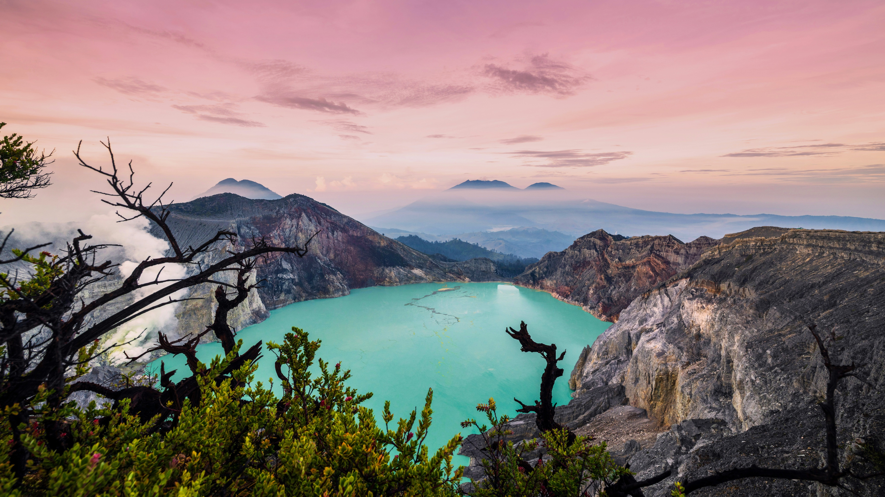
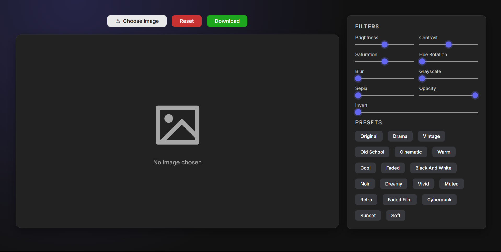
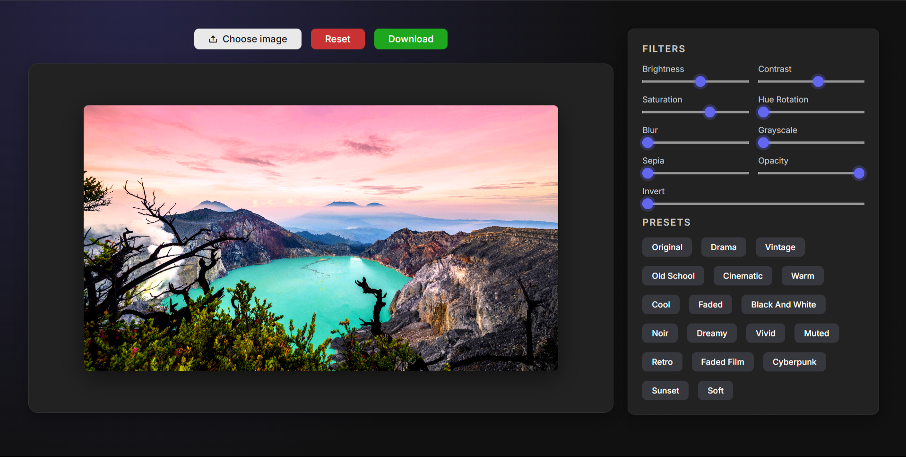
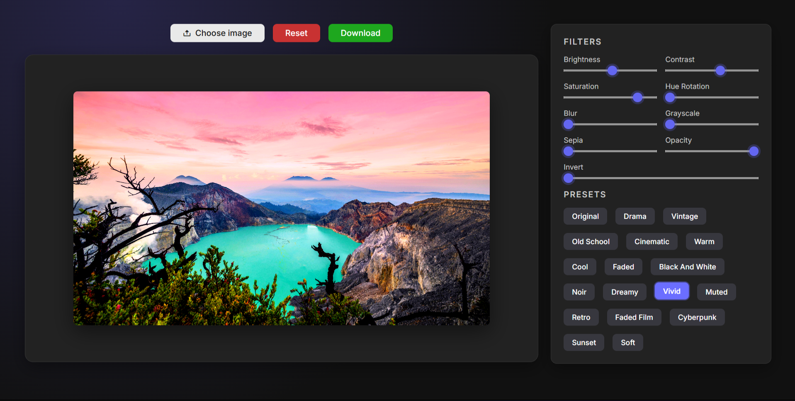
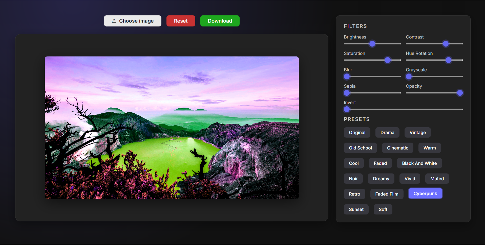
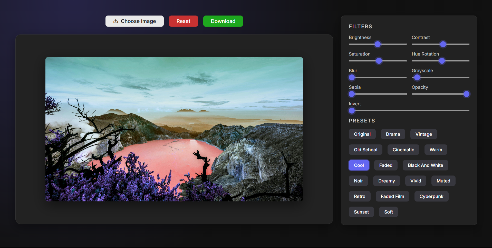
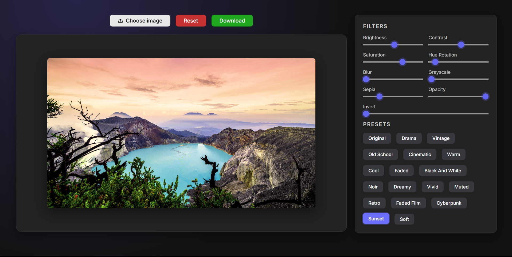

# 🖼️ Canvas Image Editor

**A browser-based photo editor with 9 live filters and 18 one-click presets.**

Upload any image, tweak it in real time using the HTML5 Canvas API and CSS filter functions, apply a mood preset like *Cyberpunk*, *Noir*, or *Vintage* in one click, then download the edited result — no uploads to any server, everything happens locally in the browser.

---

## 🚀 Live Demo

| Resource | Link |
|---|---|
| 🌐 Live Site | [Open Editor](https://anantagarwal1307.github.io/Canvas-Image-Editor/) |
| 📂 Repository | [GitHub Repo](https://github.com/anantagarwal1307/Canvas-Image-Editor) |

---

## 📸 Screenshots

| Original Photo | Empty State |
|---|---|
|  |  |

| Filters Panel (Sliders Adjusted) |
|---|
|  |

**Presets applied to the same photo:**

| Vivid | Cyberpunk |
|---|---|
|  |  |

| Cool | Sunset |
|---|---|
|  |  |

*Sample photo used above: "Kawah Ijen Crater Lake" by Rowan Heuvel, via [4kwallpapers.com](https://4kwallpapers.com/nature/kawah-ijen-crater-27374.html) — used for demo purposes only, not my own work.*

---

## 🛠️ Built With

- **HTML5 Canvas API** — image rendering and pixel-level filter application
- **CSS3** — custom properties (design tokens) for a consistent dark theme
- **Vanilla JavaScript (ES6)** — dynamic UI generation, `FileReader`/`Image` loading, `canvas.toDataURL()` for export
- **Remix Icon** — icon set for buttons
- **Google Fonts (Inter)** — typography

---

## 📁 Project Structure

```
IMAGE-EDITOR/
├── index.html
├── style.css
├── theme.css
└── script.js
```

---

## ✨ Features

- 📤 Upload any image from your device
- 🎚️ 9 adjustable filters: Brightness, Contrast, Saturation, Hue Rotation, Blur, Grayscale, Sepia, Opacity, Invert
- 🎨 18 one-click mood presets: Drama, Vintage, Old School, Cinematic, Warm, Cool, Faded, Black & White, Noir, Dreamy, Vivid, Muted, Retro, Faded Film, Cyberpunk, Sunset, Soft, and Original
- ↩️ Reset button to instantly revert to the original image
- 💾 Download the edited image as a PNG
- ⚡ All processing happens client-side — no image ever leaves the browser

---

## 🧠 How It Works

- All 9 filters are stored in a single `filters` object (value, min, max, unit for each), which is used to both generate the slider UI and build the live CSS `filter` string.
- Every slider's `input` event updates that filter's value and calls `applyFilters()`, which clears the canvas, sets `canvasCtx.filter` to the combined CSS filter string, and redraws the original image through it.
- Presets are just pre-defined value sets for the same 9 filters — clicking one overwrites the `filters` object, re-renders the sliders at their new positions, and re-applies the combined filter, so the UI and the image always stay in sync.
- Download works by reading the canvas's current pixel data via `canvas.toDataURL()` and triggering it as a file download through a temporary anchor tag.

---

## 🧠 What I Learned

- Applying real-time, combinable image filters using the Canvas 2D API's `filter` property
- Designing a single source-of-truth state object (`filters`) that drives both the UI (sliders) and the rendering logic, avoiding UI/state drift
- Building a preset system as simple data objects instead of hardcoded functions, making it easy to add new presets
- Exporting canvas content as a downloadable image file using `toDataURL()`

---

## 🕹️ How to Use

1. Open `index.html` in any browser (or visit the live demo link above)
2. Click **Choose image** and select a photo from your device
3. Drag any of the 9 filter sliders to adjust brightness, contrast, blur, and more
4. Or click any preset under **Presets** to apply a full look instantly
5. Click **Reset** to revert to the original image at any time
6. Click **Download** to save your edited image as a PNG

---

## 👤 Author

**Anant Kumar Agarwal**
- GitHub: [@anantagarwal1307](https://github.com/anantagarwal1307)

---

## 📄 License

This project is licensed under the **MIT License** — see the [LICENSE](LICENSE) file for details.
